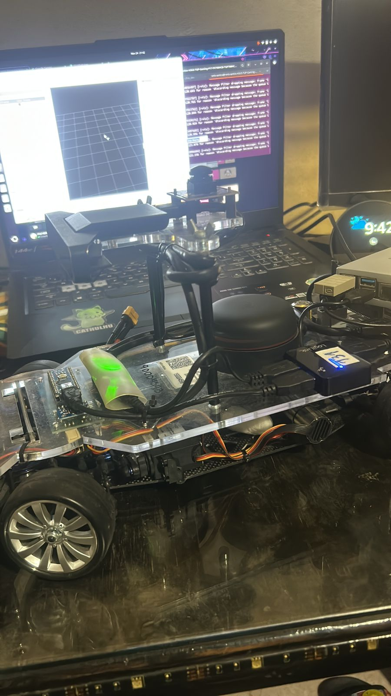

<div align="center">


</div>

# ROS 2 Development Workspace: Minibot Project

Este repositorio contiene un entorno de desarrollo para un robot autónomo con arquitectura Ackermann utilizando **ROS 2 Jazzy Jalisco** y **Gazebo Harmonic**.

El proyecto es un robot Ackermann simulado y en físico equipado con Lidar y cámara RGB, configurado para navegación autónoma mediante Nav2, mapeo con SLAM Toolbox y **detección de objetos en tiempo real con YOLOv8 nano**. El robot es capaz de navegar de forma autónoma mientras detecta y clasifica objetos en su entorno utilizando visión artificial.

## Estructura del proyecto

* **src/minibot**: paquete principal. Contiene la descripción del robot en URDF/Xacro, mundos de simulación, configuraciones de Nav2/SLAM y archivos de lanzamiento para simulador y en robot físico.
* **src/ros_fundamentals_example**: paquete corto de fin educativo con ejemplos de Publishers y Subscribers escritos en C++ y Python.
* **Dockerfile**: configuración para utilizar un contenedor de Docker en todo el entorno de desarrollo.
* **Scripts de ayuda**:
    * `quick_build.sh`: Compilación rápida con Colcon.
    * `robot_commands.sh`: Guía rápida de los comandos de teleoperación.
    * `docker_robot_guide.sh`: Guía de uso del contenedor de Docker.

## Instalación y uso

Se puede utilizar de dos maneras, vía Docker (Recomendado) o instalación nativa.

### Utilizando Docker (Recomendado)

El repositorio incluye un `Dockerfile` optimizado basado en `osrf/ros:jazzy-desktop`.

1.  **Construir la imagen:**
    Asegúrate de estar en la raíz del repositorio:
    ```bash
    docker build -t ros_minibot_dev .
    ```

2.  **Ejecutar el contenedor:**
    Se recomienda usar un script o comando que habilite los gráficos (X11/Wayland) para ver Gazebo y RViz:
    ```bash
    # Ejemplo básico permitiendo acceso a Xhost
    xhost +local:root
    docker run -it --rm \
        --name minibot_container \
        --net=host \
        --env="DISPLAY" \
        --env="QT_X11_NO_MITSHM=1" \
        --volume="/tmp/.X11-unix:/tmp/.X11-unix:rw" \
        ros_minibot_dev
    ```

### Instalación Nativa (Linux)

##### Requisitos
* Ubuntu 24.04 (Noble Numbat)
* ROS 2 Jazzy Jalisco
* Gazebo Harmonic

[Instalación ROS 2 Jazzy](https://docs.ros.org/en/jazzy/Installation.html)

Tras la instalación de ROS 2 Jazzy, realizar lo siguiente:

1.  **Instalar dependencias:**
    ```bash
    sudo apt update
    sudo apt install ros-jazzy-ros-gz ros-jazzy-navigation2 ros-jazzy-nav2-bringup ros-jazzy-slam-toolbox ros-jazzy-xacro ros-jazzy-robot-state-publisher
    ```

2.  **Compilar el workspace:**
    ```bash
    colcon build
    source install/setup.bash
    ```

## Comandos básicos
Una vez dentro del entorno (Docker o Nativo):

* **Compilar:** `colcon build`
* **Lanzar Simulación Completa:**
    ```bash
    ros2 launch minibot sim_world_robot.launch.py
    ```
    *(Ver documentación de `minibot` para más detalles)*

* **Ver Guía de Comandos:**
    ```bash
    ./robot_commands.sh
    ```

## Detección de Objetos con YOLO

El robot integra un sistema de detección de objetos en tiempo real basado en **YOLOv8 nano** de Ultralytics, capaz de identificar y clasificar 80 clases diferentes de objetos (personas, vehículos, animales, objetos cotidianos, etc.) mientras navega.

### Características del Sistema

* **Modelo:** YOLOv8 nano (versión más ligera y rápida de YOLOv8)
* **Capacidades:** Detección de 80 clases de objetos del dataset COCO
* **Umbral de confianza:** 10% (configurable en el código)
* **Rendimiento:** Optimizado para ejecución en tiempo real
* **Formatos disponibles:**
    - PyTorch (`.pt`) para entrenamiento y desarrollo
    - ONNX (`.onnx`) para inferencia optimizada

### Uso del Nodo de Detección

#### Requisitos Previos

Instalar las dependencias de Python necesarias:
```bash
pip install ultralytics opencv-python
```

#### Ejecución

**Terminal 1:** Iniciar la simulación con el robot
```bash
ros2 launch minibot sim_world_robot.launch.py
```

**Terminal 2:** Ejecutar el nodo de detección YOLO
```bash
ros2 run minibot yolo_node
```

El nodo se suscribe automáticamente al topic `/camera/image_raw` y comienza a procesar las imágenes en tiempo real. Las detecciones se visualizan en una ventana llamada "Minibot Vision" con bounding boxes y etiquetas sobre los objetos detectados.

#### Topics de ROS 2

* **Suscripción:** `/camera/image_raw` (sensor_msgs/Image) - Imágenes de la cámara del robot
* **Publicación:** `/minibot/yolo_result` (sensor_msgs/Image) - Imágenes anotadas con detecciones

### Objetos de Prueba

Los mundos de simulación (`circuit.sdf` y `laberinto.sdf`) incluyen objetos detectables:
* Personas (Standing person)
* Conos de construcción (Construction Cone)

### Script de Prueba

Para probar YOLO de forma independiente sin ROS:
```bash
python3 test_yolo.py
```

Este script descarga una imagen de ejemplo y ejecuta el modelo para verificar que está funcionando correctamente.

### Configuración Técnica

El nodo está implementado en [minibot/yolo_node.py](src/minibot/minibot/yolo_node.py) y utiliza:
* **cv_bridge:** Para convertir entre mensajes de ROS y matrices de OpenCV
* **ultralytics:** Biblioteca oficial de YOLO para inferencia
* **OpenCV:** Para visualización y procesamiento de imágenes

Para modificar el umbral de confianza o cambiar el modelo, edita el archivo `yolo_node.py`:
```python
# Línea 37: Cambiar umbral de confianza
results = self.model(cv_image, verbose=False, conf=0.1)  # 0.1 = 10%

# Línea 25: Cambiar modelo
self.model = YOLO("yolov8n.pt")  # Puedes usar yolov8s.pt, yolov8m.pt, etc.
```
### Robot físico

La siguiente parte de este proyecto fue integrar todo en el kit de robot físico que nos fue entregado por lo que teniendo los código que funcionaban dentro de la simulación se tuvieron que implementar estos al robot físico para el correcto funcionamiento del mismo. 



Foto del kit de robot físico que se nos fue entregado para el desarrollo del proyecto

### Pasos para iniciar el robot físico 


