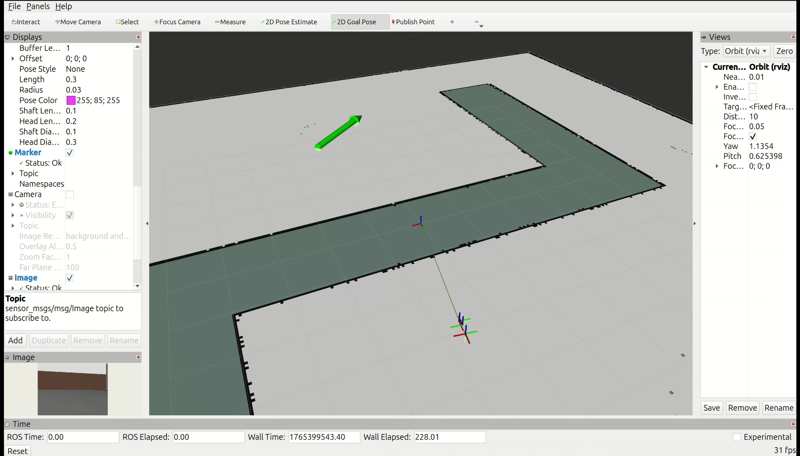
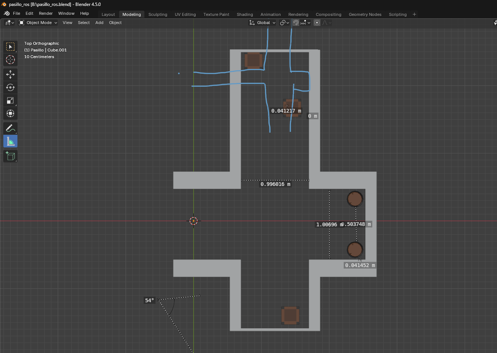

<div align="center">

[](README.md)
[](README_en.md)

</div>

# Paquete Minibot

Minibot es un robot móvil de configuración Ackermann simulado en Gazebo, equipado con capacidades de navegación autónoma mediante Nav2 y detección de objetos en tiempo real con YOLOv8.

## Especificaciones Técnicas

### 1. Cinemática y Física (`robot_main.xacro`)
El robot utiliza el plugin `gz-sim-ackermann-steering-system` para la simulación física.

* **Tipo de Tracción:** Trasera (Ruedas `rear_left` y `rear_right`).
* **Dirección:** Delantera (Joints `front_left_steer` y `front_right_steer`).
* **Límites de Dirección:** Máximo 0.6 radianes (~34°) a la izquierda/derecha.
* **Dimensiones:**
    * Chasis: 0.32m (largo) x 0.24m (ancho).
    * Batalla (Wheelbase): 0.32m.
    * Ancho de vía (Track width): 0.266m.
* **Odometría:** Calculada y publicada por Gazebo en `/odom`.

### 2. Sensores Integrados
* **Lidar 2D (`lidar.xacro`):**
    * Sensor: `gpu_lidar`.
    * Tópico: `/scan`.
    * Configuración: 360° de visión, rango de 10 metros, frecuencia 10Hz.
    * Ubicación: Montado sobre el chasis con offset vertical.
* **Cámara RGB (`camera.xacro`):**
    * Tópico: `/camera/image_raw`.
    * Resolución: 640x480.
    * FOV Horizontal: ~1.09 rad.
    * **Uso:** Entrada para el sistema de detección de objetos YOLOv8, permitiendo identificación en tiempo real de personas, vehículos y objetos diversos.

## Flujo de Trabajo: Mapeo y Navegación

El uso del robot se divide en dos fases: primero generar el mapa (SLAM) y luego usar ese mapa para navegar de forma autónoma (Nav2).

### Fase 1: Generación de Mapa (SLAM) + Teleoperación

**Terminal 1: Simulación y SLAM**
Inicia Gazebo, el robot, los puentes de ROS, SLAM Toolbox y RViz configurado para mapeo.
```bash
ros2 launch minibot sim_world_robot.launch.py \
  use_slam:=true \
  use_rviz:=true \
  headless:=false
```

**Terminal 2: Control Manual**
Mueve el robot para explorar. Recuerda que al ser Ackermann, debes avanzar (`i`) o frenar (`k`) mientras giras (`u`/`o`).

```bash
ros2 run teleop_twist_keyboard teleop_twist_keyboard \
  --ros-args -r cmd_vel:=/cmd_vel
```

Una vez tengas el mapa completo, guárdalo usando el panel de "SlamToolbox" en RViz o mediante comandos de:

```bash
ros2 run nav2_map_server map_saver_cli -f <nombre_del_mapa>
```

### Fase 2: Navegación Autónoma

**Terminal 1: Simulación Base**
Inicia solo el entorno y el robot.

```bash
ros2 launch minibot sim_world_robot.launch.py \
  use_slam:=false \
  use_rviz:=false \
  headless:=false
```

**Terminal 2: Stack de Navegación**
Inicia Nav2 cargando el mapa. (Asegúrate de cambiar la ruta del mapa en base a donde lo hayas guardado).

```bash
ros2 launch minibot sim_nav.launch.py map:=ruta_mapa.yaml
```

**Terminal 3: Visualización**
Abre RViz con la configuración específica para visualizar y utilizar Nav2.

```bash
ros2 launch minibot visualize_nav.launch.py
```

Dentro de la nueva ventana de RViz aparecerá el TF del robot. Selecciona **2D Pose Estimate** y haz clic en el TF del robot (no debe ser muy preciso, pero de preferencia en el centro del robot). Posteriormente, selecciona **2D Goal Pose** y selecciona donde quieres ir; verás que aparece una flecha verde, indicando hacia donde terminará mirando el robot una vez que llegue a la cola de la flecha.



## Sistema de Detección de Objetos con YOLO

### 3. Visión Artificial: YOLOv8 Nano

El robot integra un nodo de ROS 2 que ejecuta **YOLOv8 nano** (You Only Look Once versión 8) para detección de objetos en tiempo real. YOLO es uno de los modelos de detección de objetos más rápidos y eficientes, especialmente adecuado para aplicaciones robóticas que requieren inferencia en tiempo real.

#### Características del Modelo

* **Arquitectura:** YOLOv8 nano (yolov8n)
* **Biblioteca:** Ultralytics YOLO
* **Clases detectables:** 80 categorías del dataset COCO, incluyendo:
    - Personas (person)
    - Vehículos (car, bus, truck, bicycle, motorcycle)
    - Animales (dog, cat, bird, horse, etc.)
    - Objetos cotidianos (bottle, cup, chair, laptop, cell phone, etc.)
    - Señales y elementos urbanos (traffic light, stop sign, etc.)
* **Formatos disponibles:**
    - `yolov8n.pt`: Modelo PyTorch (usado por defecto)
    - `config/yolov8n.onnx`: Modelo ONNX optimizado para producción

#### Implementación del Nodo YOLO

El nodo está implementado en [`minibot/yolo_node.py`](minibot/yolo_node.py:1-66) como una clase que hereda de `rclpy.node.Node`:

**Pipeline de procesamiento:**

1. **Suscripción:** El nodo se suscribe al topic `/camera/image_raw` (sensor_msgs/Image)
2. **Conversión:** cv_bridge convierte el mensaje ROS a formato OpenCV (BGR8)
3. **Inferencia:** YOLOv8 procesa la imagen con umbral de confianza del 10%
4. **Anotación:** Se dibujan bounding boxes, etiquetas y confianza sobre los objetos detectados
5. **Visualización:** Se muestra la imagen procesada en una ventana "Minibot Vision"
6. **Publicación:** La imagen anotada se publica en `/minibot/yolo_result`

**Características del nodo:**

* **Modo de inferencia:** Nativo con PyTorch (verbose=False para reducir salida en terminal)
* **Umbral de confianza:** 0.1 (10%) - Configurable en línea 37
* **Rate de procesamiento:** Variable `process_rate = 5` (configurable para procesar cada N frames)
* **Gestión de recursos:** Destrucción apropiada de ventanas OpenCV al terminar

#### Uso del Nodo

**Instalación de dependencias:**
```bash
pip install ultralytics opencv-python
```

**Lanzamiento básico:**
```bash
# Terminal 1: Lanzar simulación
ros2 launch minibot sim_world_robot.launch.py

# Terminal 2: Ejecutar nodo YOLO
ros2 run minibot yolo_node
```

**Verificación de topics:**
```bash
# Ver imagen original de la cámara
ros2 topic echo /camera/image_raw

# Ver resultados de YOLO
ros2 topic echo /minibot/yolo_result

# Visualizar con rqt_image_view
ros2 run rqt_image_view rqt_image_view /minibot/yolo_result
```

#### Configuración Avanzada

**Cambiar umbral de confianza:**
```python
# En yolo_node.py línea 37
results = self.model(cv_image, verbose=False, conf=0.25)  # 25% de confianza
```

**Usar un modelo más grande (mayor precisión, menor velocidad):**
```python
# En yolo_node.py línea 25
self.model = YOLO("yolov8s.pt")  # Small
self.model = YOLO("yolov8m.pt")  # Medium
self.model = YOLO("yolov8l.pt")  # Large
```

**Usar modelo ONNX para mayor eficiencia:**
```python
self.model = YOLO("config/yolov8n.onnx")
```

**Procesar solo cada N frames:**
```python
# En yolo_node.py línea 28
self.process_rate = 10  # Procesar 1 de cada 10 frames

# En el callback agregar:
self.frame_count += 1
if self.frame_count % self.process_rate != 0:
    return
```

#### Integración con Navegación

El nodo YOLO puede ejecutarse simultáneamente con Nav2 para permitir:

* **Detección de obstáculos dinámicos:** Identificar personas u objetos en movimiento
* **Reconocimiento de señales:** Detectar conos de tráfico, señales de alto, etc.
* **Navegación semántica:** Tomar decisiones basadas en el tipo de objeto detectado
* **Logging de eventos:** Registrar objetos detectados durante misiones autónomas

**Ejemplo de uso conjunto:**
```bash
# Terminal 1: Simulación
ros2 launch minibot sim_world_robot.launch.py use_slam:=false

# Terminal 2: Stack de navegación
ros2 launch minibot sim_nav.launch.py map:=tu_mapa.yaml

# Terminal 3: Visualización Nav2
ros2 launch minibot visualize_nav.launch.py

# Terminal 4: Detección YOLO
ros2 run minibot yolo_node
```

#### Objetos de Prueba en Simulación

Los mundos de Gazebo han sido actualizados con objetos detectables:

**circuit.sdf:**
* Standing person en posición (2.0, -1.0, 0.0)
* Construction Cone en posición (2.0, -1.0, 0.0)

**laberinto.sdf:**
* Standing person en posición (2.0, 0.0, 0.0)
* Construction Cone en posición (3.0, 1.0, 0.0)

Estos modelos se descargan automáticamente desde Gazebo Fuel la primera vez que se lanzan los mundos.

#### Script de Prueba Independiente

Para verificar que YOLO funciona correctamente sin ROS:

```bash
python3 test_yolo.py
```

Este script:
1. Carga el modelo YOLOv8 nano
2. Descarga una imagen de prueba (bus de Londres) desde Ultralytics
3. Ejecuta detección con umbral del 10%
4. Muestra los resultados en una ventana

Es útil para depurar problemas de instalación o configuración del modelo sin la complejidad de ROS.

#### Dependencias del Sistema

El nodo requiere las siguientes dependencias declaradas en `package.xml`:

* `rclpy`: Cliente Python de ROS 2
* `sensor_msgs`: Mensajes de sensores (Image)
* `cv_bridge`: Conversión entre ROS Image y OpenCV
* `image_transport`: Transporte eficiente de imágenes

Y dependencias Python (no gestionadas por ROS):

* `ultralytics`: Biblioteca YOLO
* `opencv-python` (cv2): Procesamiento de imágenes
* `torch`: Backend de PyTorch para inferencia

#### Entry Point

El nodo está registrado en `setup.py` como:
```python
entry_points={
    'console_scripts': [
        'yolo_node = minibot.yolo_node:main',
    ]
}
```

Esto permite ejecutarlo con `ros2 run minibot yolo_node`.

## Estructura de archivos

### Launch Files
  * **launch/sim\_world\_robot.launch.py**: Launcher maestro. Orquesta Gazebo, el robot y (opcionalmente) SLAM.
  * **launch/sim\_nav.launch.py**: Inicia el stack de Nav2 con `RegulatedPurePursuitController`.
  * **launch/visualize\_nav.launch.py**: Abre RViz con una configuración para poder utilizar Nav2.

### Configuración
  * **config/minibot\_slam\_mapping.yaml**: Parámetros de SLAM Toolbox.
  * **config/nav2\_params.yaml**: Parámetros de navegación.
  * **config/yolov8n.onnx**: Modelo YOLOv8 nano en formato ONNX optimizado.

### Nodos Python
  * **minibot/yolo\_node.py**: Nodo de ROS 2 para detección de objetos con YOLOv8.

### Mundos de Simulación
  * **worlds/circuit.sdf**: Circuito básico con objetos detectables (persona, cono).
  * **worlds/laberinto.sdf**: Laberinto con obstáculos y objetos detectables.

## Escenarios de Prueba Personalizados

### Mapa: Pasillo de Obstáculos
Se ha integrado un nuevo entorno de simulación diseñado para pruebas de navegación en espacios confinados.

* **Herramienta de Modelado:** Blender (Exportado a formato `.dae`/`.sdf`).
* **Geometría:**
    * **Tipo:** Pasillo recto (Corridor).
    * **Ancho de vía:** 1.0 metros (Distancia muro a muro), diseñado para probar la precisión del planificador local.
* **Obstáculos:** 5 elementos dinámicos/estáticos distribuidos en el trayecto:
    * 3 Cajas de madera.
    * 2 Barriles industriales.
* **Propósito:** Validar la capacidad del robot para maniobrar y evadir obstáculos sin colisionar en entornos estrechos donde el radio de giro Ackermann es crítico.



### Objetos Detectables para Visión Artificial

Los mundos `circuit.sdf` y `laberinto.sdf` incluyen objetos de prueba para validar el sistema de detección YOLO:

**Tipos de objetos:**
* **Standing person**: Modelo de persona de pie (detectado como clase "person" por YOLO)
* **Construction Cone**: Cono de construcción naranja (detectado como "traffic cone")

**Propósito:**
* Verificar que la cámara del robot tiene campo de visión adecuado
* Validar el pipeline completo de detección en tiempo real
* Probar la integración entre navegación y visión artificial
* Servir como casos de prueba para desarrollo de navegación semántica

Los objetos se descargan automáticamente desde [Gazebo Fuel](https://fuel.gazebosim.org/) la primera vez que se ejecuta la simulación con estos mundos.
